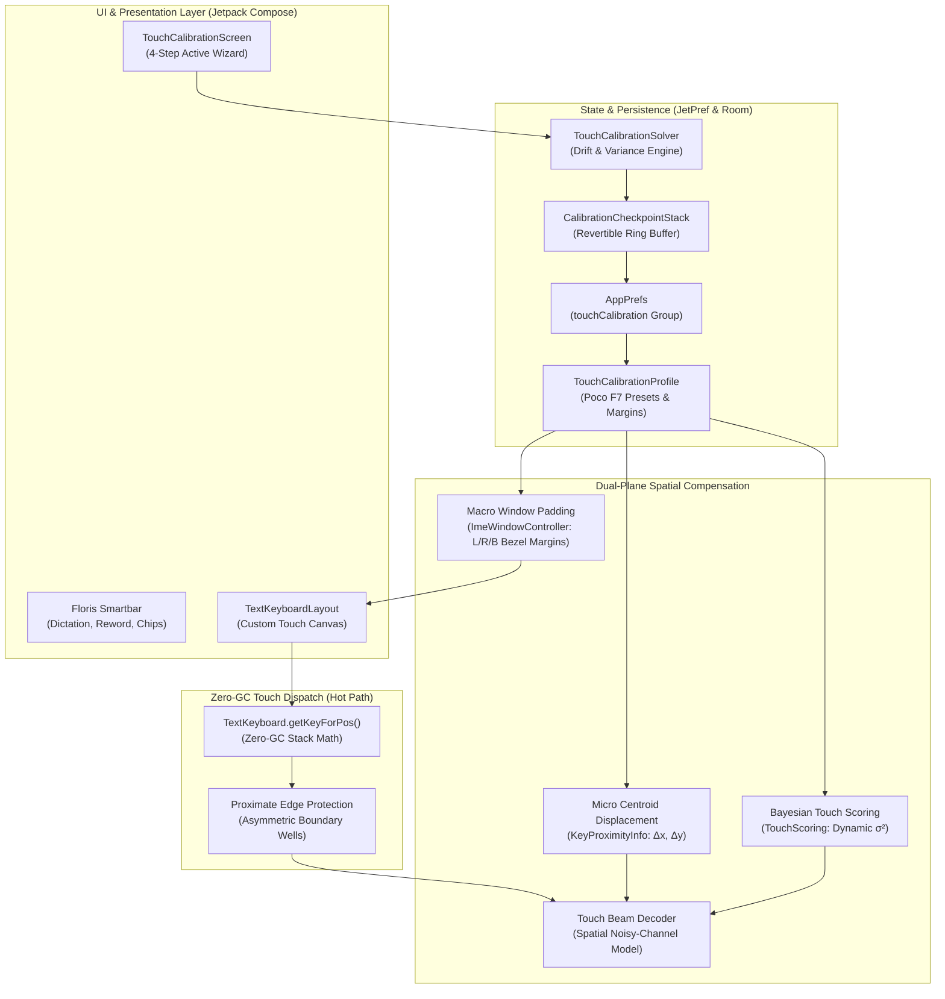
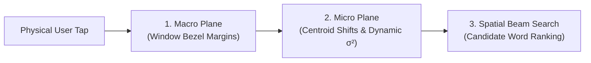
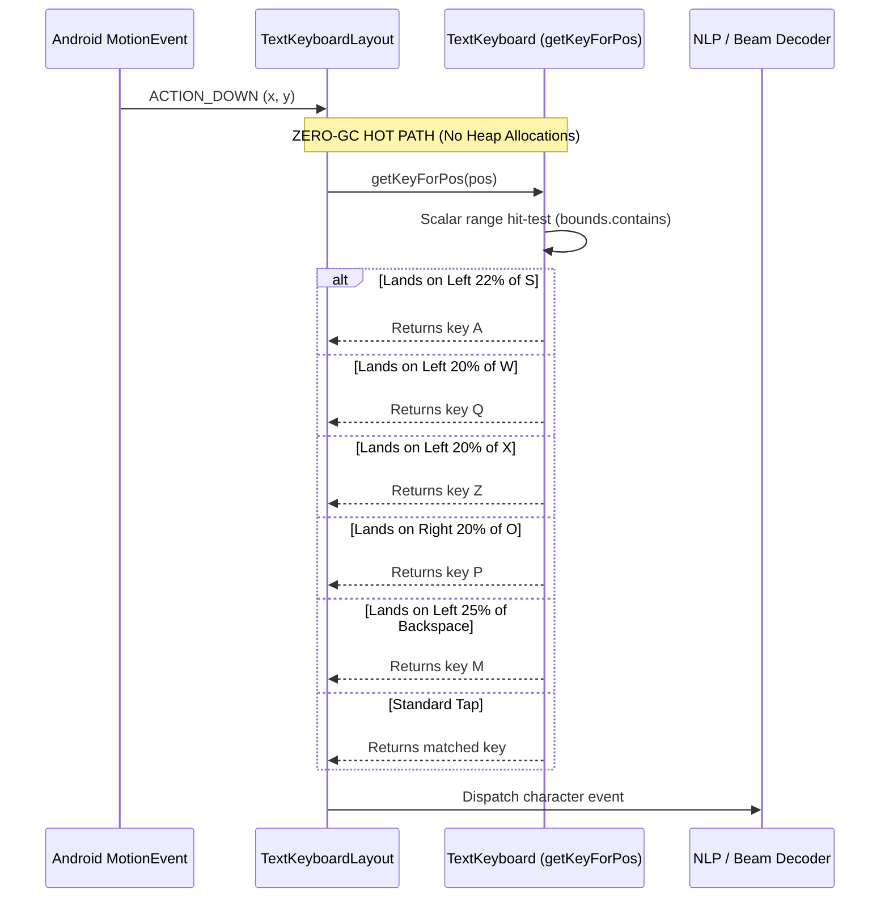
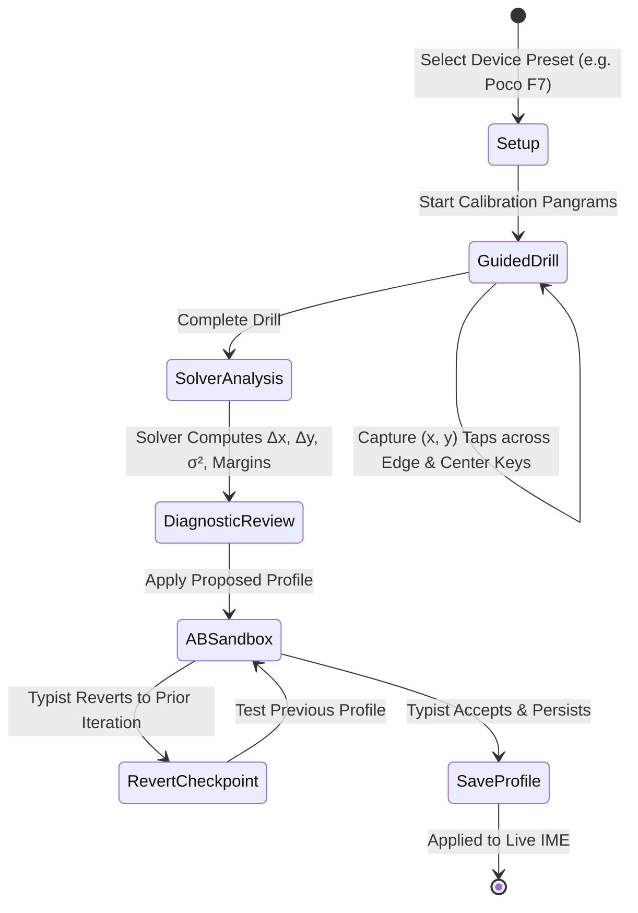

# ARH Whisper Board — Technical Architecture & Design Specification (`design.md`)

This document describes the internal engineering architecture, spatial touch physics, active-learning calibration engine, and performance invariants of **ARH Whisper Board**.

---

## 1. System Topology & Architectural Philosophy

ARH Whisper Board is an ergonomic, low-latency Android Input Method Editor (IME) engineered for terminal power users, fast thumb typists, Whisper AI voice transcription, and native Markdown clipboard workflows.



---

## 2. Thumb Ergonomics & Touch Physics

### 2.1 The Ergonomic Retraction Deficit on Modern Displays
Modern high-aspect-ratio mobile displays (e.g., Xiaomi Poco F7, 6.67", 20:9 ratio, ~395 dp logical width) place outer keys within the extreme articulation limits of human thumb anatomy:
* **Natural Thumb Pivot**: When holding the phone with two hands, the carpometacarpal (CMC) and metacarpophalangeal (MCP) joints establish a comfortable resting arc over the interior keyboard columns:
  - **Left Thumb Arc**: Keys `E-D-X` and `R-F-C`.
  - **Right Thumb Arc**: Keys `U-J-N` and `I-K-M`.
* **Retraction Mechanics**: Reaching the leftmost column (`Q`, `A`, `Z`) requires the left thumb to contract inward toward the palm (thenar eminence). This inward contraction has higher mechanical resistance and shorter travel than outward extension.
* **Empirical Drift Vector**: Typists targeting `A` systematically fall short by 4–8 mm (15–30 dp), landing on the left flank of `S`. Typists targeting `Q` undershoot into `W`. Typists targeting `Z` undershoot into `X`. Typists targeting `P` with the right thumb undershoot into `O`.
* **Corner Destructive Collisions**: Key `M` is adjacent to destructive system keys (`Backspace` and `Enter`). When typing terminal commands rapidly, grazing the boundary triggers line deletion or accidental execution.

```
+---+---+---+---+---+---+---+---+---+---+
| Q | W | E | R | T | Y | U | I | O | P |   <- Q undershoots to W; P undershoots to O
+---+---+---+---+---+---+---+---+---+---+
  | A | S | D | F | G | H | J | K | L |     <- A undershoots to S (Natural left pivot: D/F)
  +---+---+---+---+---+---+---+---+---+
    | Z | X | C | V | B | N | M | BKSP|     <- Z undershoots to X; M grazes BKSP
    +---+---+---+---+---+---+---+-----+
```

---

## 3. Dual-Plane Spatial Compensation Architecture

To resolve physical thumb friction without breaking visual layout balance, ARH Whisper Board separates spatial compensation into two complementary planes:



### 3.1 Macro Plane: Window Bezel Padding
Managed in [`ImeWindowController.kt`](file:///D:/_ARH-AGENT-OS/projects/arh-whisper-board/app/src/main/kotlin/dev/patrickgold/florisboard/ime/window/ImeWindowController.kt#L269-L288) and [`ImeWindowProps.kt`](file:///D:/_ARH-AGENT-OS/projects/arh-whisper-board/app/src/main/kotlin/dev/patrickgold/florisboard/ime/window/ImeWindowProps.kt#L30-L60):
* Injects physical margins around the IME surface: `paddingLeft`, `paddingRight`, and `paddingBottom`.
* Rather than requiring the user to bend thumbs into the display glass bezel, the entire keyboard canvas is indented inward (e.g., 8–16 dp on the sides for Poco F7).
* Edge keys (`Q`, `A`, `Z`, `P`, `Backspace`, `Enter`) are brought directly into the natural thumb sweep arc.

### 3.2 Micro Plane: Virtual Centroid Displacement & Variance
Managed in [`KeyProximityInfo.kt`](file:///D:/_ARH-AGENT-OS/projects/arh-whisper-board/app/src/main/kotlin/dev/patrickgold/florisboard/ime/nlp/latin/KeyProximityInfo.kt#L105-L150) and [`TouchScoring.kt`](file:///D:/_ARH-AGENT-OS/projects/arh-whisper-board/app/src/main/kotlin/dev/patrickgold/florisboard/ime/nlp/latin/TouchScoring.kt#L1-L60):
* Leaves visible key labels and graphic boxes unchanged to preserve clean visual aesthetics.
* Adjusts the virtual geometric centroids $(x_c, y_c)$ used by the spatial beam decoder:
  $$x'_c = x_c + \Delta x_{\text{calibrated}}, \quad y'_c = y_c + \Delta y_{\text{calibrated}}$$
* Dynamically adapts the Gaussian spatial likelihood function:
  $$P(\text{tap}(x,y) \mid \text{key}_k) = \frac{1}{2\pi \sigma^2} \exp\left( -\frac{(x - x'_k)^2 + (y - y'_k)^2}{2\sigma^2} \right)$$
  where $\sigma^2$ is tuned to the user's specific tap precision (default: 0.25; relaxed: 0.35; tight: 0.18).

---

## 4. Low-Level Touch Dispatch & Zero-GC Pipeline

The touch dispatch hot path runs at display refresh rates (up to 120 Hz, deadline: 8.33 ms). Any heap allocation inside this loop causes young-generation garbage collection pauses and frame jank.



### 4.1 Boundary Math Implementation
Inside [`TextKeyboard.kt`](file:///D:/_ARH-AGENT-OS/projects/arh-whisper-board/app/src/main/kotlin/dev/patrickgold/florisboard/ime/text/keyboard/TextKeyboard.kt#L41-L150):
```kotlin
// Example: S -> A Retraction Guard
if (key.computedData.asRange().first == KeyCode.LETTER_S) {
    val relX = pos.x - key.visibleBounds.left
    if (relX >= 0f && relX < key.visibleBounds.width * 0.22f) {
        val aKey = findKey(KeyCode.LETTER_A)
        if (aKey != null) return aKey
    }
}
```
All variables are primitive JVM floats allocated on the stack. No `PointF`, `RectF`, `ArrayList`, or iterator instances are created.

---

## 5. Active-Learning Calibration Engine

The calibration subsystem provides a closed-loop tuning workflow:



### 5.1 Statistical Solver Formulation
In [`TouchCalibrationSolver.kt`](file:///D:/_ARH-AGENT-OS/projects/arh-whisper-board/app/src/main/kotlin/dev/patrickgold/florisboard/ime/text/keyboard/TouchCalibrationSolver.kt#L1-L120):
1. **Sample Capture**: For each keycode $k$, collect $N_k$ tap coordinates $\{(x_i, y_i)\}_{i=1}^{N_k}$.
2. **Mean Drift Vector**:
   $$\Delta x_k = \frac{1}{N_k}\sum_{i=1}^{N_k}(x_i - x_{k,\text{center}}), \quad \Delta y_k = \frac{1}{N_k}\sum_{i=1}^{N_k}(y_i - y_{k,\text{center}})$$
3. **Variance Estimation**:
   $$\sigma^2 = \frac{1}{2}\left( \frac{1}{N}\sum (x_i - \bar{x})^2 + \frac{1}{N}\sum (y_i - \bar{y})^2 \right)$$
4. **Bezel Margin Recommendation**:
   If left-edge keys (`A`, `Q`, `Z`) exhibit an average rightward undershoot $\overline{\Delta x}_{\text{left}} > 4.0\,\text{dp}$, the solver proposes increasing `paddingLeft` by $\min(\overline{\Delta x}_{\text{left}} \times 1.5, 24.0\,\text{dp})$.

### 5.2 Revertible Checkpoint Stack
In [`TouchCalibrationProfile.kt`](file:///D:/_ARH-AGENT-OS/projects/arh-whisper-board/app/src/main/kotlin/dev/patrickgold/florisboard/ime/text/keyboard/TouchCalibrationProfile.kt#L80-L140):
```kotlin
data class CalibrationCheckpointStack(
    val checkpoints: List<TouchCalibrationProfile> = emptyList(),
    val activeIndex: Int = -1,
) {
    fun push(profile: TouchCalibrationProfile): CalibrationCheckpointStack
    fun canUndo(): Boolean = activeIndex > 0
    fun undo(): CalibrationCheckpointStack
    fun redo(): CalibrationCheckpointStack
}
```
Maintains up to 10 historical snapshots. Every calibration iteration can be undone instantly if typing accuracy degrades.

---

## 6. Subtype Isolation Protocol

To prevent Latin QWERTY tuning offsets from distorting other languages or scripts:
1. All offsets in `TouchCalibrationProfile.keyOffsets` are keyed strictly by **character keycode** (`KeyCode` / `Int`).
2. During layout calculation in [`KeyProximityInfo.kt`](file:///D:/_ARH-AGENT-OS/projects/arh-whisper-board/app/src/main/kotlin/dev/patrickgold/florisboard/ime/nlp/latin/KeyProximityInfo.kt#L105-L150):
   ```kotlin
   val code = key.computedData.asRange().first
   val (dx, dy) = profile.keyOffsets[code] ?: (0f to 0f)
   ```
3. Non-Latin scripts (Arabic, Cyrillic, Greek, Devanagari) and symbol/numeric layers receive `(0f, 0f)` and retain their original geometric centroids.

---

## 7. Verification & Conformance Harness

The codebase enforces continuous quality assurance through two levels of verification:

1. **Preflight Doctor** ([`tools/whisper_doctor.py`](file:///D:/_ARH-AGENT-OS/projects/arh-whisper-board/tools/whisper_doctor.py#L1-L124)):
   - Runs in **~120 ms**.
   - Executes AST pattern checking on `getKeyForPos` to ensure zero prohibited heap allocations.
   - Triggers `ci_asbuilt_doctor.py`.
2. **As-Built Conformance Doctor** ([`scripts/ci_asbuilt_doctor.py`](file:///D:/_ARH-AGENT-OS/projects/arh-whisper-board/scripts/ci_asbuilt_doctor.py#L1-L88)):
   - Verifies 100% bidirectional parity between [`capabilities.json`](file:///D:/_ARH-AGENT-OS/projects/arh-whisper-board/capabilities.json#L1-L92) and [`asbuilt.md`](file:///D:/_ARH-AGENT-OS/projects/arh-whisper-board/asbuilt.md#L1-L72).
   - Verifies physical existence of all architectural code anchors on disk.
3. **Gradle Unit Test Suite**:
   - 17 unit tests verifying edge protection, solver math, checkpoint stack undo/redo, subtype isolation, and serialization roundtrips.
